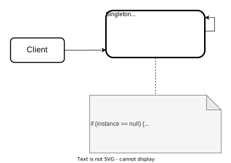

# Singleton Design Pattern

- provides a single instance of an object, while providing a global access point to this instance
- gurantees that there are no duplicates

## Solution
All the implementations of the Singleton have 2 steps in common:
- Make the default constructor private, to prevent other objects from using the `new` operator with the Singleton class
- Create a static creation method that acts as a constructor. Under the hood, this method calls the private constructor to create an object and saves it in a static field. All the following calls to this method return the cached object.

If your code has access to the Singleton class, then it's able to call the Singleton's static method. So whenever that method is called, the same object is always returned.

</img>

### How to implement 
1. Add a private static field to the class storing the singleton instance.
2. Declare a public static creation method for the getting the singleton instance.
3. Implement `lazy initialization` inside the static method.
4. Make the constructor of the class private; only static method of the class will still be able to call the constructor.

## Usecases:
- when you want to use the same connection to a database to make every query
- when you open SSH connection to a server to do a few tasks
- if you need to limit the access to some variable or space
- if you need to limit the number of calls to some places

## When to apply:
- we need a single, shared value of some particular type
- we need to restrict object creation of some type to a single unit along with entire program

### Pros:
- A single instance requisite is accomplished.
- A global access point to that instance is gained.
- The singleton object is initialized only when it's requested for the first time.

### Cons:
- Violates the <i>Single Responsibility Principle</i>. The pattern solves two problems at the time.
- The Singleton pattern can make bad design, for instance, when the components of the program know two much about each other.
- The pattern requires special treatment in a multithreaded environment so that multiple threads won't create a singleton object several times.
- It may be difficult to unit test the client code of the Singleton, as many test frameworks rely on inheritance when producing mock objects. Since, the constructor of the singleton class is private and overriding static methods is impossible in most languages, you will need to think of a creative way to mock the singleton, or just dont' write the tests, don't use singleton pattern.